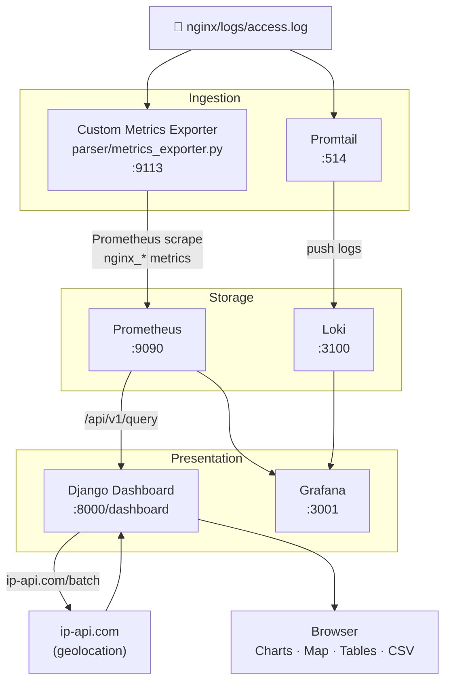

# Nginx Observability Dashboard

A full-stack observability platform for nginx access logs — built for the UCC Hackathon 2025.

Reads nginx access logs in real time, detects anomalies, and presents everything on a custom dark-themed dashboard with charts, tables, a geolocation map, and CSV export.

## Architecture



## Stack

| Service | Role | Port |
|---|---|---|
| Django | Custom dashboard UI + API | 8000 |
| Custom metrics exporter | Parses nginx logs, exposes Prometheus metrics | 9113 |
| Prometheus | Metrics storage and querying | 9090 |
| Grafana | Provisioned backup dashboard | 3001 |
| Loki + Promtail | Raw log ingestion | 3100 |

## Features

- **Summary stats** — total requests, unique IPs, bytes transferred, 2xx responses, 4xx/5xx errors, anomalous IPs
- **Anomaly detection** — high-volume IPs (mean + 2×std dev), request spike windows, error burst windows
- **Red alert banner** — appears automatically when anomalies are detected
- **Interactive filters** — filter all metrics by status code or IP address
- **Bar charts** — requests by status code (colour-coded) and by HTTP method, rendered with Chart.js
- **IP tables** — top IPs by volume and anomalous IPs with CRITICAL/HIGH badges
- **Geolocation map** — dark CartoDB world map with clickable markers for every IP (powered by ip-api.com)
- **CSV export** — one-click report download with summary, status breakdown, top IPs, and anomalous IPs
- **Grafana provisioned dashboard** — same metrics available as a backup in Grafana

## Running the full stack

Docker Desktop must be running.

```bash
cd nginx_observability_dashboard
docker compose up --build
```

| URL | What |
|---|---|
| http://localhost:8000/dashboard/ | Custom Django dashboard |
| http://localhost:9090 | Prometheus |
| http://localhost:3001 | Grafana (admin / admin) |
| http://localhost:9113/metrics | Raw Prometheus metrics from the exporter |

## Running Django locally (without Docker)

```bash
# From the repo root
python -m venv .venv
source .venv/Scripts/activate   # Windows
# source .venv/bin/activate     # Mac/Linux

pip install -r nginx/requirements.txt
cd nginx
python manage.py runserver
```

Prometheus must be running separately for metrics to populate.

## Anomaly Detection

The custom exporter (`parser/metrics_exporter.py`) applies three detection methods:

1. **High-volume IPs** — flags any IP whose request count exceeds `mean + 2 × std dev` across all IPs
2. **Request spikes** — counts 1-minute windows where traffic exceeds the per-window mean + 2×std dev
3. **Error bursts** — counts 1-minute windows where more than 50% of requests returned 4xx/5xx

## Project Structure

```
nginx_observability_dashboard/
├── docker-compose.yml
├── nginx/                  # Django app
│   ├── nginx/              # Django project settings
│   ├── nginx_dashboard/    # Dashboard views, templates, API endpoints
│   ├── users/              # Auth (login/logout)
│   └── logs/               # nginx access.log goes here
├── parser/                 # Custom Prometheus exporter
├── prometheus/             # prometheus.yml scrape config
├── grafana/                # Provisioned Grafana dashboard + datasource
│   ├── dashboards/
│   └── provisioning/
├── loki/
└── promtail/
```
